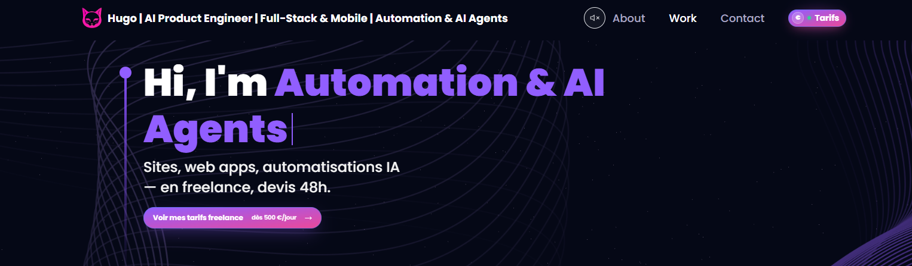
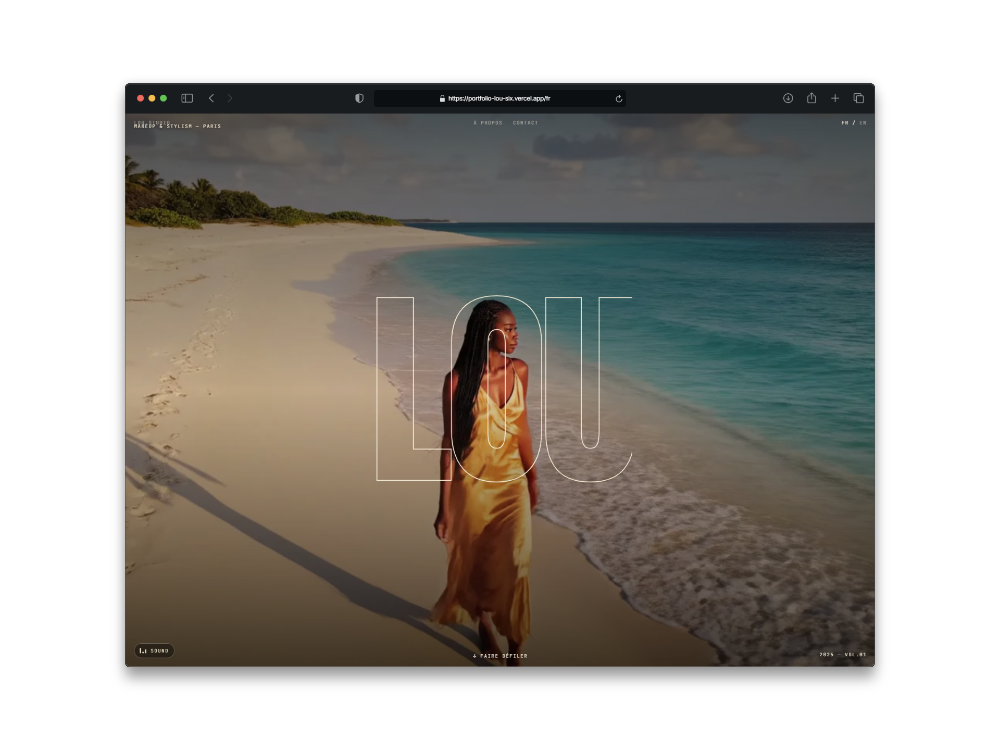
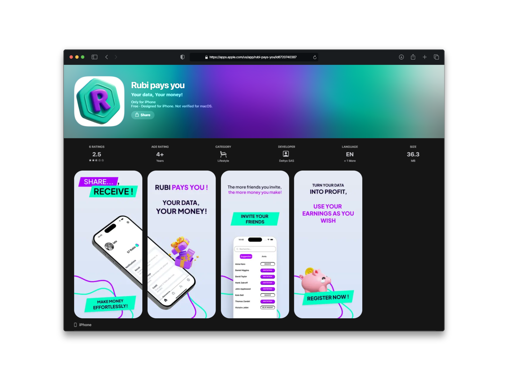
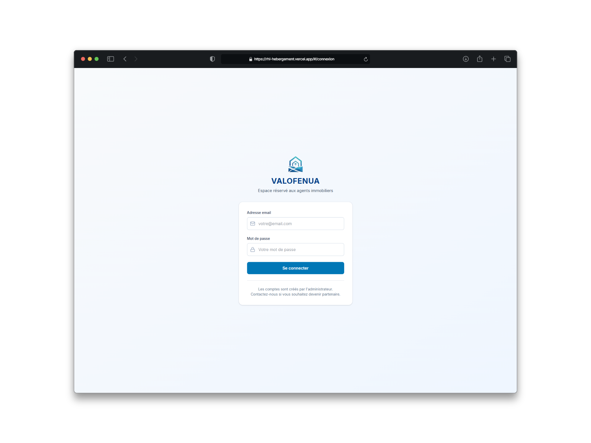
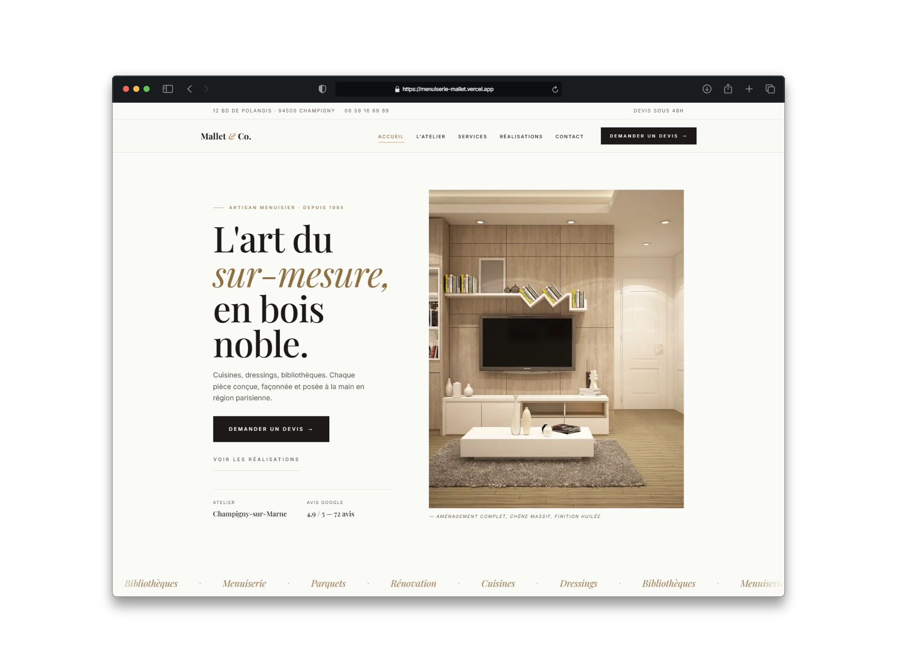
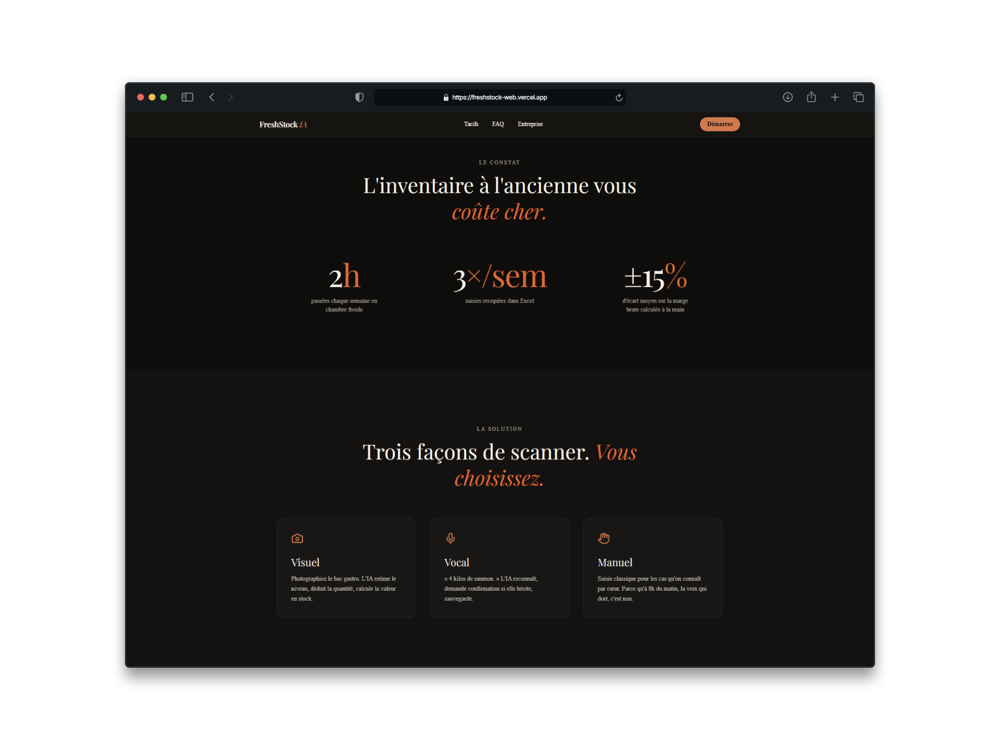
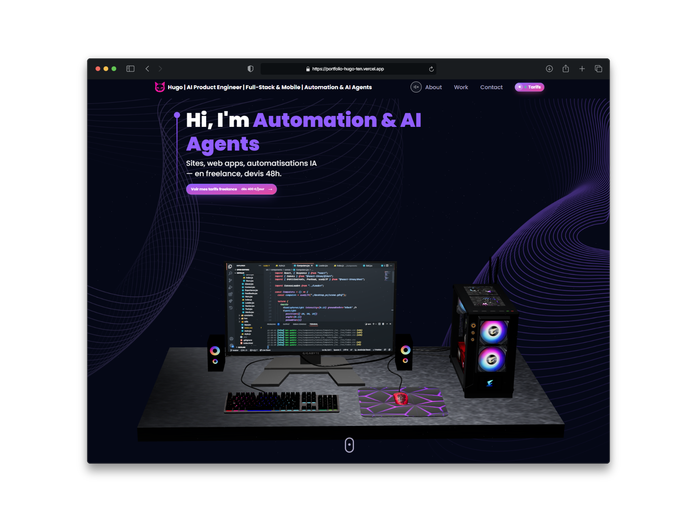

<!-- BANNIÈRE — remplacer par votre image, ou supprimer ce bloc -->

  

<h1 align="center">Hugo Boidin</h1>
<h3 align="center">Dev full-stack augmenté à l'IA · Du design au déploiement · Maintenance long terme</h3>

  Je conçois et livre des sites web & applications mobiles de A à Z. 
  Rapide grâce à l'IA, toujours à jour sur les dernières technos.

  📩 <strong>Disponible pour missions freelance & opportunités CDI</strong>

  
  &nbsp;
  

  ⚡ <strong>4,5 ans d'XP</strong> · 🚀 <strong>6 projets livrés en prod</strong> · 🌍 <strong>Clients FR & EU</strong>

---

## 💡 Pourquoi travailler avec moi

- 🤖 **Augmenté à l'IA** — j'utilise Claude, GPT et des agents custom au quotidien. Je code 2-3x plus vite qu'un dev classique, sans rogner sur la qualité.
- ⚡ **Livraison rapide** — site vitrine en quelques jours (Lou Studio : **5 jours**, Olivier Mallet : **4 jours**), SaaS complet en 2-3 mois.
- 🔄 **Toujours à jour** — je teste les nouvelles technos en continu (frameworks, modèles IA, outils). Tu ne te retrouves jamais avec une stack obsolète.
- 🛠️ **Maintenance mensuelle incluse** — je ne disparais pas après le launch. Tu as un dev qui suit ton produit dans le temps.

---

## 🛠️ Stack actuelle

**Front-end** — Next.js · React · React Native · TypeScript · Tailwind · Three.js · Framer Motion · GSAP  
**Back-end** — Node.js · FastAPI · Python · PostgreSQL · Supabase · Redis  
**IA & Automation** — OpenAI · Claude · n8n · Whisper · AI Agents · Prompt Engineering  
**DevOps** — Docker · Vercel · Railway · GitHub Actions

---

## 🚀 Projets récents

<table>
  <tr>
    <td width="33%" align="center">
      
       <strong>Lou Studio</strong>
       Site vitrine immersif 3D
       <em>⚡ Livré en 5 jours</em>
       Next.js · Three.js · GSAP
    </td>
    <td width="33%" align="center">
      
       <strong>Rubi te paye</strong>
       App mobile · paiement + graphe
       <em>📱 6 mois · CDI / en équipe</em>
       React Native · Stripe · Neo4j
    </td>
    <td width="33%" align="center">
      
       <strong>Valofenua</strong>
       SaaS · agents IA + PDF
       <em>🤖 Livré en 3 mois</em>
       React · Supabase · n8n · OpenAI
    </td>
  </tr>
  <tr>
    <td width="33%" align="center">
      
       <strong>Olivier Mallet</strong>
       Site artisan · géolocalisation
       <em>⚡ Livré en 4 jours</em>
       React · Chakra UI · Google Maps
    </td>
    <td width="33%" align="center">
      
       <strong>FreshStock</strong> (bientôt)
       SaaS B2B pour restaurateurs
       <em>🚀 Sortie 15/06 · construit en 2 mois</em>
       React Native · FastAPI · Whisper
    </td>
    <td width="33%" align="center">
      
       <strong>Portfolio</strong>
       Mon site perso · vitrine de mon style
       <em>🎨 Conçu & livré solo</em>
       Next.js · Three.js · Framer Motion
    </td>
  </tr>
</table>

---

## 📫 Me contacter

🌐 **Portfolio** — [portfolio-hugo-ten.vercel.app](https://portfolio-hugo-ten.vercel.app)  
💼 **LinkedIn** — [hugoboidin](https://www.linkedin.com/in/hugoboidin)  
📩 **Email** — hugolsd18@gmail.com

---

  ⚡ La plupart de mes contributions actuelles sont sur des repos privés clients. 
  Les repos publics ici sont des projets perso, expérimentations open-source ou contributions client autorisées.

